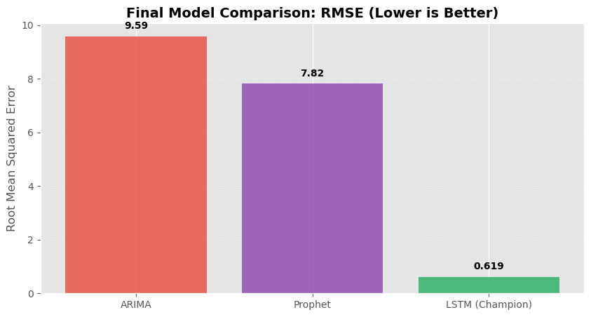

# Economic-Time-Series-Forecasting-on-AWS-SageMaker AI with ARIMA, Prophet, and LSTM

## 📊 Model Comparison Results

## 🏆 Champion Model: XGBoost Performance

## **📈 Project Overview**
This project forecasts U.S. Consumer Price Index (CPI) values using a multi-model approach, ranging from classical statistical methods to high-performance gradient boosting. The primary objective was to evaluate model accuracy under a rigorous time-series validation framework and demonstrate production-level deployment.

## Key Highlights

- Model Benchmarking: Evaluated performance across classical statistical models, trend-based forecasting, and gradient boosting.

- Performance: The XGBoost model significantly outperformed statistical baselines. By utilizing a 12-month lookback window and stationarity transformations, it captured complex inflationary patterns that traditional models failed to detect.

- Deployment: Fully integrated and deployed using AWS SageMaker AI for scalable inference.

## Data
- Source: Federal Reserve Economic Data (FRED)
- Series: CPIAUCSL
- Frequency: Monthly

## Methods
- ARIMA (baseline statistical model)
- Prophet (trend + seasonality model)
- XGBoost (feature-engineered regressor with stationarity transformation)

A 24-month holdout period is used for evaluation.

## Results
The XGBoost model achieved the lowest MAE and RMSE on the holdout set by far, Outperforming both ARIMA and Prophet:

**Performance on Holdout Set (Dec 2023 – Nov 2025):**

| Model             | MAE   | RMSE  |
|------------------|-------|-------|
| XGBoost(Winner)   | 1.83 | 2.0 |
| Prophet           | 7.09  | 7.15  |
| ARIMA (1,1,1)     | 8.04  | 9.29  |

## Methodology & Technical Implementation
- The Pivot from LSTM: Testing showed that deep learning struggled with the small monthly sample size and non-stationary trend of CPI data, leading to a shift toward a more robust tree-based approach.

- Data Transformation: Applied First-Order Differencing to remove trend bias. The model was trained to predict monthly changes (Delta) rather than absolute values to ensure stationarity.

- Feature Engineering: Implemented a 12-month sliding window of lag features. This captures seasonal momentum and annual cycles that traditional statistical models often overlook.

- Technical Optimization: Utilized XGBoost to handle non-linear relationships within the features, resulting in a significantly lower error rate compared to ARIMA and Prophet.

## Deployment
The selected model is serialized and packaged into a `model.tar.gz`.  I also included a custom inference handler and optional deployment script and I intentionally excluded deployment from the notebook to avoid unnecessary cloud costs.
